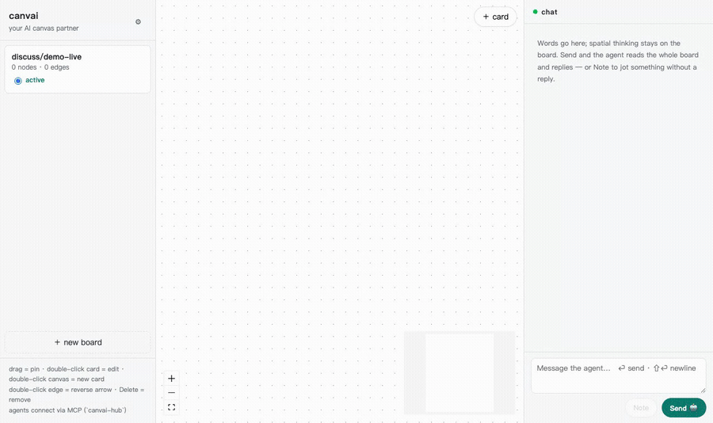
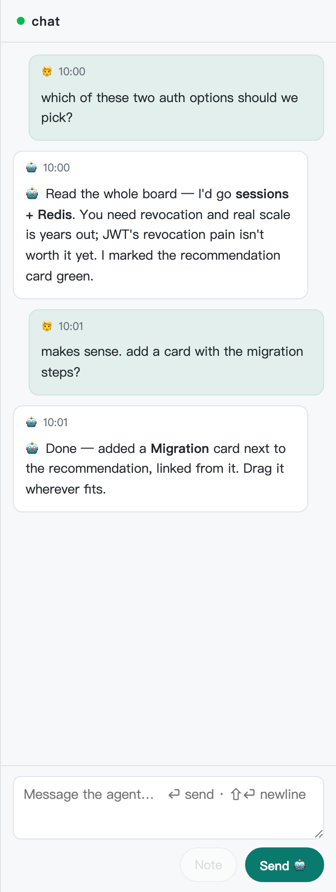
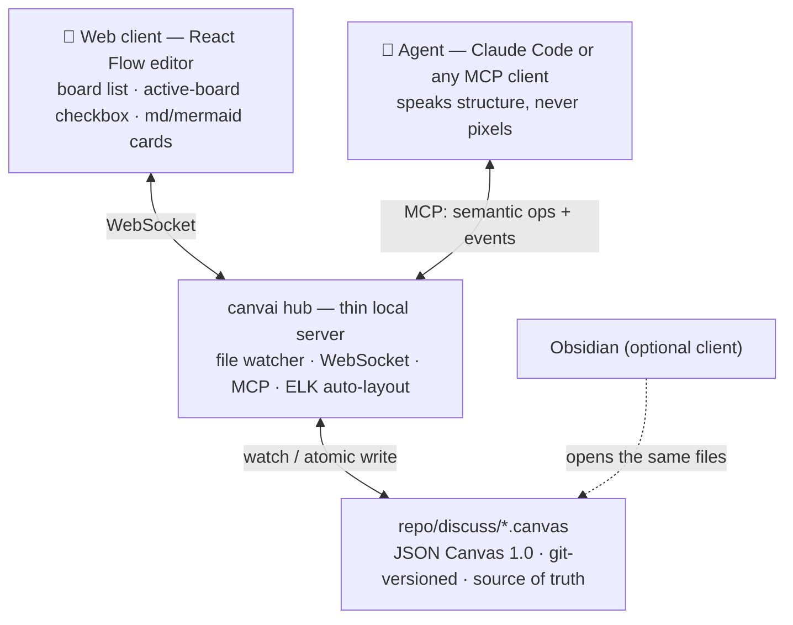

<div align="center">



# canvai

**The whiteboard built for you and your agent.** Describe what you're thinking — your coding agent sketches it on a shared canvas of cards, connections, and diagrams, and reshapes it with you, live.

[](https://github.com/chuck00lin/canvai/stargazers)
[](https://github.com/chuck00lin/canvai/network/members)
[](https://opensource.org/licenses/MIT)

繁體中文說明請見 **[README.zh-TW.md](README.zh-TW.md)**

</div>

Boards are plain [JSON Canvas](https://jsoncanvas.org) files in your repo, versioned by git. Drop canvai into any project, point [Claude Code](https://claude.com/claude-code) (or any MCP client) at it, and discuss in the browser instead of the terminal — no design tool, no account, no Obsidian required.

```bash
cd /path/to/your/project
npx canvai init      # wire canvai in — .mcp.json + Claude Code pre-approval
npx canvai serve     # → http://127.0.0.1:5199
```

That's it — no clone, no build step. Requires **Node 18+**. Running it a lot? `npm i -g canvai` and drop the `npx`.

> **What works today:** the whole human↔agent loop runs now — add canvai to any repo, open the board in your browser, and Claude Code edits it live while you drag cards back at it (MCP hub + canvas library + React Flow client, watcher → WebSocket). The board *protocol* is still soft — we're collecting real-world use cases before freezing it. **Wished you could whiteboard architecture with an agent instead of scrolling a terminal? [Tell us how you'd use it](.github/ISSUE_TEMPLATE/use-case.yml)** — early use cases shape this project the most.

## Why canvai

Terminals are a narrow pipe for visual thinkers — and today they're the only pipe we share with our agents. canvai gives you and an AI partner one shared, infinite canvas: you think spatially by dragging and grouping, the agent reads the *whole board* and reshapes it with you. Like Miro or FigJam, except the participants include AI agents — and the file is just JSON Canvas in your repo, so your thinking stays yours.

## Highlights

### 🧑‍🤝‍🤖 One canvas, both of you on it
Drop ideas as cards, connect them, sketch the shape of a problem. The agent reads the entire board, replies in place, and reshapes it with you — a real shared surface, not a chat log with a picture attached.

### 🧠 The agent speaks structure, never pixels
Agents send semantic operations over MCP (`add_node`, `connect`, `insert_mermaid`, …) and read a coordinate-free structural projection. An [ELK](https://eclipse.dev/elk/) layout engine turns structure into positions, so the agent focuses on meaning while the canvas handles space.

### 📄 Your boards are just files in your repo
Every board is a [JSON Canvas](https://jsoncanvas.org) file under `discuss/`, git-versioned and the single source of truth. Nothing is locked in a cloud — clone the repo and your thinking comes with it.

### 📌 Human intent wins
Any card you drag is **pinned**: `auto_layout` flows around it, and the agent picks up your arrangement on its next read. You arrange; the agent adapts.

### 🧜 Mermaid in, canvas out
Agents can emit Mermaid; the hub explodes it into real canvas nodes (parse → layout → nodes). Dense structural diagrams (sequence, state) render *inside* cards as fenced blocks. Mermaid is an I/O language, not a storage format.

### 🪟 Obsidian optional
The web client is the whole UI — nothing else to install. But because boards are JSON Canvas files, if you already use [Obsidian](https://obsidian.md) you can open the repo as a vault and they render and edit natively.

### 🌐 Run it anywhere — even with no VPN
Local by default. Add `--host 0.0.0.0 --token` for your LAN/VPN, or a [cloudflared](https://developers.cloudflare.com/cloudflare-one/connections/connect-networks/downloads/) tunnel for a public HTTPS URL with no port-forward. Opt-in `--report-url` telemetry reports crashes/errors from a remote install while it's still early. See **[docs/deploy.md](docs/deploy.md)**.

## Get started

**Wire it in** — from the repo you want boards in:

```bash
cd /path/to/your/project
npx canvai init
```

This writes a `canvai` MCP server into `.mcp.json` and pre-approves it for Claude Code. *(Want it from source, or contributing? `git clone` + `node scripts/setup.mjs --repo .` does the same — see [docs/deploy.md](docs/deploy.md).)*

**Open the canvas**:

```bash
npx canvai serve --root . --autocommit   # → http://127.0.0.1:5199
```

**Think together** — ask Claude Code *"create a board `discuss/architecture.canvas`, set it active, and sketch our module structure"*, and cards appear in the browser as it works. Drag one and it's **pinned** — `auto_layout` flows around it and the agent picks up your arrangement on its next read. Double-click to edit markdown (` ```mermaid ` fences render as diagrams), draw edges from the side handles, tick a board **active** to point the agent at it. In the side chat, **Send** asks the agent; **Note** just jots on the board.

<div align="center">

</div>

## The core idea

Diagrams have two possible sources of truth, and the split maps exactly onto who is good at what:

|  | Structure-first (e.g. Mermaid) | Position-first (e.g. JSON Canvas) |
|---|---|---|
| Truth | nodes & relations, layout derived | coordinates, layout stored |
| Natural for | **agents** — one line of text per relation | **humans** — dragging, grouping, whitespace as meaning |
| Weakness | positions have nowhere to live → can't drag | verbose coordinates → token cost, spatial reasoning |

canvai refuses to pick a side:

- **Persistence is position-first** — `discuss/*.canvas` files (JSON Canvas 1.0) in your repo, so human drags always have somewhere to land, and Obsidian opens them for free.
- **The agent interface is structure-first** — semantic ops over MCP and a coordinate-free projection; ELK turns structure into positions. **Agents never think in pixels.**
- **Human intent wins** — any node a human dragged is *pinned*; auto-layout routes around it.
- **Mermaid is an I/O language, not storage** — agents emit Mermaid, the hub explodes it into canvas nodes; dense diagrams render inside cards.

## Architecture



Every layer can fail independently: kill the server and humans still open boards in Obsidian; skip Obsidian and the web client works; close every client and agents still read the files. Choosing the persistence format well buys all of that.

### MCP surface

| Tool | Purpose | Status |
|---|---|---|
| `list_boards` / `get_active_board` / `set_active_board` / `create_board` | discover boards; share one focus between human and agent | ✅ |
| `read_board(mode)` | `structure` (default, coordinate-free) · `full` | ✅ |
| `apply_ops([...])` | atomic batch of semantic edits: add / update / delete / connect / group / move, with `$ref` chaining | ✅ |
| rails (in `apply_ops`) | an ordered list with a spatial projection — timelines & fishbones as list ops, never coordinates | ✅ |
| `auto_layout` | ELK layered pass; pinned nodes stay put, groups move as blocks | ✅ |
| `events_since(cursor)` | what humans did since last sync: web edits, Obsidian edits, other agents | ✅ |
| `insert_mermaid(text)` | Mermaid → parse → ELK layout → canvas nodes | planned |

## What's next

Here today: the full loop — add canvai to any repo and Claude Code sketches on a board in your browser while you drag cards back at it (MCP hub, canvas library, a thin local server with atomic writes that preserve unknown fields, a React Flow editor with the active-board loop, human drags that pin nodes and surface in `events_since`).

Next: **real-time** — a CRDT document layer (Yjs) for simultaneous human + agent editing, presence (cursors), Mermaid import-explode, an `@agent` pin protocol, and multi-board portals. The board *protocol* stays soft until real use cases settle it.

**Non-goals:** an interactive Mermaid engine (the language has no position vocabulary — see the [design doc](docs/design.md#decision-2)); a cloud service (local-first, your repo is the backend); real-time CRDT before turn-based collaboration proves itself.

## Contributing

The most valuable contribution right now is a **use case**: who you are, what you'd put on the board, what the agent should do there. [Open a use-case issue](.github/ISSUE_TEMPLATE/use-case.yml) — or challenge the design decisions in [docs/design.md](docs/design.md). See [CONTRIBUTING.md](CONTRIBUTING.md).

## Prior art & credits

canvai stands on ideas validated by others: [Kanvas](https://github.com/XMihura/Kanvas) (humans + agents on Obsidian Canvas via semantic CLI ops), [Bragi Canvas](https://community.obsidian.md/plugins/bragi-canvas) (active canvas over local MCP), the Excalidraw MCP ecosystem ([excalidash-mcp](https://github.com/davifernan/excalidash-mcp), [mcp_excalidraw](https://github.com/yctimlin/mcp_excalidraw)) for live agent drawing, the [tldraw Agent Starter Kit](https://tldraw.dev/starter-kits/agent) for agent-on-canvas interaction design, and the [JSON Canvas](https://jsoncanvas.org) open format by Obsidian. The full survey is in the [design doc](docs/design.md#prior-art).

## License

MIT
