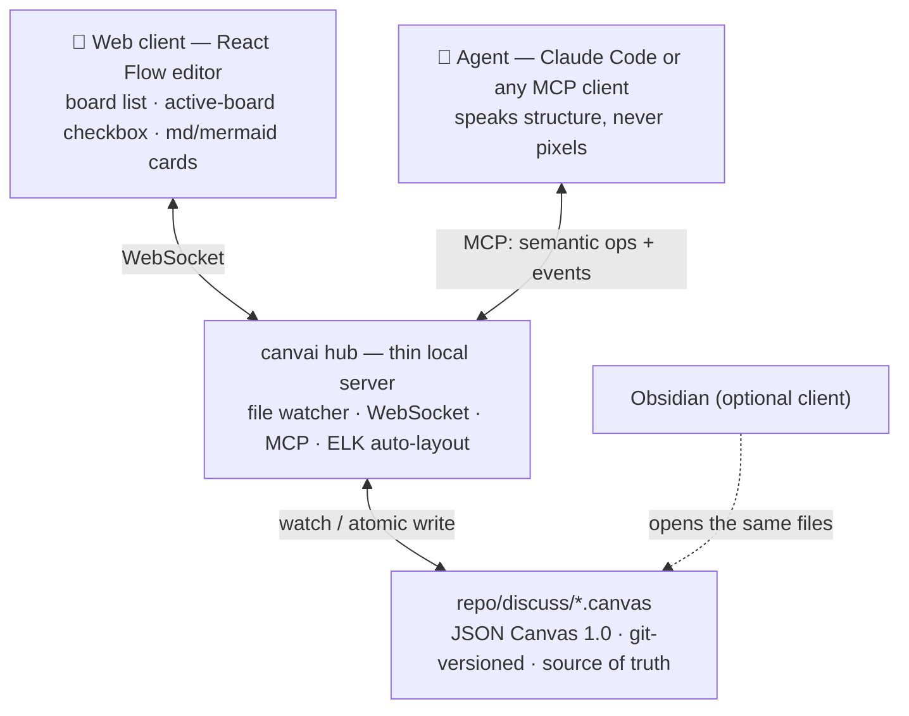

# canvai

**Your AI canvas partner — a discussion tool for visual thinkers, on every project.**

Terminals are a narrow pipe for visual thinkers, and today it is the only pipe we share with our agents. canvai gives you and an AI partner one shared, infinite canvas: drop ideas as cards, connect them, sketch the shape of a problem — and the agent reads the whole board, replies in place, and reshapes it with you. Like Miro or FigJam, except the participants include AI agents.

**Drop it into any repo, point [Claude Code](https://claude.com/claude-code) (or any MCP client) at it, and discuss in the browser instead of the terminal.** No design tool, no account, no Obsidian required — boards are plain [JSON Canvas](https://jsoncanvas.org) files in your repo, versioned by git. Your thinking stays yours.


> **What works today:** add canvai to any repo, open the board in your browser, and Claude Code edits it live while you drag cards back at it — the whole human↔agent loop runs now (MCP hub + canvas library + React Flow web client, watcher → WebSocket). The board *protocol* is still soft: we're collecting real-world use cases before freezing it. **Wished you could discuss architecture with an agent on a whiteboard instead of a terminal? [Tell us about it](.github/ISSUE_TEMPLATE/use-case.yml)** — early use cases shape this project the most.

## Quickstart — canvai + Claude Code, in any repo

Requires Node ≥ 23.6 (runs TypeScript natively; no build step for the hub).

```bash
git clone git@github.com:chuck00lin/canvai.git
cd canvai && npm install && npm run web:build   # web:build once, for the browser client
```

**1 · Point Claude Code at the repo you want to think about.** Add canvai to that repo's `.mcp.json` (works with any MCP client):

```json
{
  "mcpServers": {
    "canvai": {
      "command": "node",
      "args": ["/path/to/canvai/packages/hub/src/cli.ts", "--root", "."]
    }
  }
}
```

**2 · Open the canvas.** From that same repo:

```bash
node /path/to/canvai/packages/hub/src/cli.ts serve --root .
# → http://127.0.0.1:5199
```

**3 · Think together.** Ask Claude Code something like:

> create a board `discuss/architecture.canvas`, set it active, and sketch our module structure on it

Cards appear in the browser as the agent works. Drag one and it is **pinned**: `auto_layout` flows around it, and the agent picks your arrangement up on its next read (`events_since`). Double-click a card to edit markdown (``` ```mermaid ``` fences render as diagrams), draw edges from the side handles, and tick a board **active** in the sidebar to point the agent at it. The MCP process and the serve process coordinate purely through files — run either one alone, or both. This very repo dogfoods the loop: [`examples/decision.canvas`](examples/decision.canvas) is a board worked through with an agent.

The side chat is for words; the board is for spatial thinking. **Send** and the agent reads the whole board and replies; **Note** just jots on the board without a reply.


**Obsidian is optional.** The web client is the whole UI — nothing else to install. But because boards are just [JSON Canvas](https://jsoncanvas.org) files, if you already use [Obsidian](https://obsidian.md) you can open the repo as a vault and they render (and edit) natively. canvai reads and writes that format; it credits it, it doesn't depend on it.

**Remote / same-VPN access.** The hub binds `127.0.0.1` by default. To open a board from another machine on your VPN or LAN:

```bash
npm run serve -- --host 0.0.0.0 --token choose-a-secret
# from the remote machine: http://<this-machine's VPN IP>:5199/?token=choose-a-secret
```

The token guards `/api` and `/ws` (the static shell carries no data); the CLI prints every reachable address on startup and warns if you expose without a token. Prefer zero flags? An SSH tunnel also works: `ssh -L 5199:127.0.0.1:5199 <host>`, then open `http://127.0.0.1:5199` locally.

## The core idea

Diagrams have two possible sources of truth, and the split maps exactly onto who is good at what:

|  | Structure-first (e.g. Mermaid) | Position-first (e.g. JSON Canvas) |
|---|---|---|
| Truth | nodes & relations, layout derived | coordinates, layout stored |
| Natural for | **agents** — one line of text per relation | **humans** — dragging, grouping, whitespace as meaning |
| Weakness | positions have nowhere to live → can't drag | verbose coordinates → token cost, spatial reasoning |

canvai refuses to pick a side. Instead:

- **The persistence layer is position-first**: `discuss/*.canvas` files (JSON Canvas 1.0) in your repo, so human drags always have somewhere to land — and Obsidian opens them natively, for free.
- **The agent interface is structure-first**: agents speak semantic operations over MCP (`add_node`, `connect`, `insert_mermaid`, …) and read a coordinate-free structural projection. An auto-layout engine (ELK) turns structure into positions. **Agents never think in pixels.**
- **Human intent wins**: any node a human has dragged is *pinned*; auto-layout routes around it.
- **Mermaid is an I/O language, not a storage format**: agents can emit Mermaid, the hub explodes it into canvas nodes (parse → layout → nodes); dense structural diagrams (sequence, state) render *inside* cards as fenced blocks.

## Architecture



*(Yes, that diagram is Mermaid. Structure-first formats are exactly right for docs — that's the point.)*

Every layer can fail independently: kill the server and humans still open boards in Obsidian; skip Obsidian and the web client works; close every client and agents still read the files. Choosing the persistence format well buys all of that.

### The active-board loop

1. The human ticks a board as **active** in the web sidebar.
2. The hub records it and notifies subscribed agents.
3. The agent's next `get_active_board` call focuses there — reads a structural projection, applies ops, and the human watches cards appear live.
4. Humans reply *on the board*: drag, annotate, or drop an `@agent` pin as a structured question.

### MCP surface

| Tool | Purpose | Cost profile | Status |
|---|---|---|---|
| `list_boards` / `get_active_board` / `set_active_board` / `create_board` | discover boards; share one focus between human and agent | O(boards) | ✅ Phase 0 |
| `read_board(mode)` | `structure` (default, coordinate-free) · `full` | structure ≈ ⅓ of full | ✅ Phase 0 |
| `apply_ops([...])` | atomic batch of semantic edits: add / update / delete / connect / group / relative move, with `$ref` chaining | O(change) | ✅ Phase 0 |
| `auto_layout` | ELK layered pass; pinned (human-arranged) nodes stay put, groups move as blocks | O(1) call | ✅ Phase 0 |
| `events_since(cursor)` | what humans did since last sync: web edits, Obsidian edits, other agents | O(diff) | ✅ Phase 1 |
| `insert_mermaid(text)` | Mermaid → parse → ELK layout → canvas nodes | structure price, positions free | Phase 2 |

## Roadmap

- **Phase 0 — zero frontend.** ✅ shipped. MCP server + `.canvas` files + Obsidian as the viewer. Validates that discussing *on a board* beats discussing in a terminal, and measures real token costs. Turn-based collaboration.
- **Phase 1 — own client.** ✅ core shipped. The thin local server (watcher + WebSocket + atomic writes that preserve unknown fields) and a React Flow editor with the active-board loop. Agent edits appear live in the browser; human drags pin nodes and surface in `events_since`.
- **Phase 2 — real-time.** CRDT document layer (Yjs), presence (human and agent cursors), Mermaid import-explode, the `@agent` pin protocol, multi-board portals.

**Non-goals:** an interactive Mermaid engine (the language has no position vocabulary — see the [design doc](docs/design.md#decision-2) for why every attempt converges back to a canvas); a cloud service (local-first, your repo is the backend); real-time CRDT before turn-based collaboration proves itself.

## Contributing

The most valuable contribution right now is a **use case**: who you are, what you'd put on the board, what the agent should do there. [Open a use-case issue](.github/ISSUE_TEMPLATE/use-case.yml) — or challenge the design decisions in [docs/design.md](docs/design.md). See [CONTRIBUTING.md](CONTRIBUTING.md).

繁體中文說明請見 [README.zh-TW.md](README.zh-TW.md)。

## Prior art & credits

canvai stands on ideas validated by others: [Kanvas](https://github.com/XMihura/Kanvas) (humans + agents on Obsidian Canvas via semantic CLI ops), [Bragi Canvas](https://community.obsidian.md/plugins/bragi-canvas) (active canvas over local MCP), the Excalidraw MCP ecosystem ([excalidash-mcp](https://github.com/davifernan/excalidash-mcp), [mcp_excalidraw](https://github.com/yctimlin/mcp_excalidraw)) for live agent drawing, the [tldraw Agent Starter Kit](https://tldraw.dev/starter-kits/agent) for agent-on-canvas interaction design, and the [JSON Canvas](https://jsoncanvas.org) open format by Obsidian. The full survey with sources is in the [design doc](docs/design.md#prior-art).

## License

[MIT](LICENSE)
