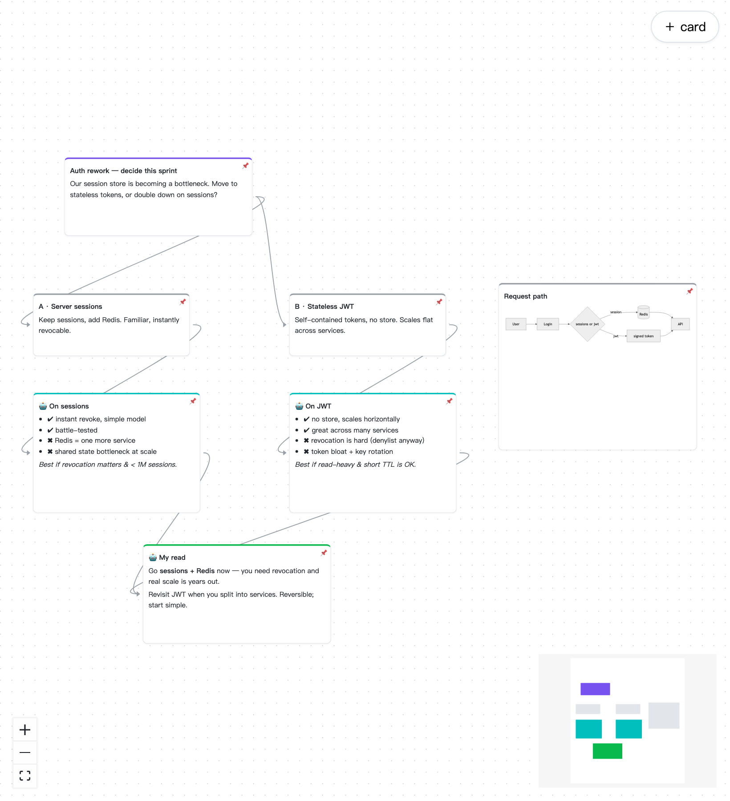

# canvai（繁體中文）

**你的 AI 畫布夥伴——為視覺化思考者打造的討論工具,適用每一個 project。**

Terminal 對視覺化思考者是一條太窄的管道。canvai 讓你和一個 AI 夥伴共享一張無限畫布:把想法丟成卡片、連起來、把問題的形狀畫出來——agent 讀整張板、就地回應、跟你一起重塑它。像 Miro / FigJam,但參與者包含 AI agent。人類在瀏覽器(或 Obsidian)裡拖拉卡片;agent 透過 MCP 讀寫同一塊板。板子就是 repo 裡的 [JSON Canvas](https://jsoncanvas.org) 純文字檔,跟程式碼一起被 git 版控——你的思考仍屬於你。

> **現在就能用:** 把 canvai 接到任何 repo,在瀏覽器打開板,Claude Code 就能即時在上面編輯、你同時拖卡片回應它——整個人↔agent 閉環現在就跑得起來(MCP hub＋canvas 函式庫＋React Flow web client,watcher→WebSocket)。**不需要 Obsidian、不需要帳號、不需要設計工具。** 板的*協定*仍在收斂,我們正收集真實情境再凍結它。安裝步驟見英文版 [README](README.md) 的 Quickstart。**曾希望能跟 agent 在白板上而不是 terminal 討論架構?[告訴我們你的情境](.github/ISSUE_TEMPLATE/use-case.yml)**——早期需求最能形塑這專案。

## 核心想法

- **持久層是 position-first**：`discuss/*.canvas`（JSON Canvas 1.0）放在你的 repo 裡，人類的拖拉永遠有地方落地——Obsidian 還能免費原生開啟。
- **Agent 介面是 structure-first**：agent 用 MCP 語意操作（`add_node`、`connect`、`insert_mermaid`…），讀「去座標的結構投影」；ELK auto-layout 負責把結構翻譯成座標。**Agent 從頭到尾不需要思考像素。**
- **人類意圖優先**：被人拖過的節點會 pin 住，auto-layout 繞開它。
- **Mermaid 是 I/O 語言，不是儲存格式**：agent 可以輸出 mermaid，由 hub 爆開成 canvas 節點；密集結構圖（sequence、state）以 fenced block 形式在卡片內原地渲染。

## 架構與路線

架構圖與完整決策理由（含「為什麼不做 mermaid 互動引擎」「為什麼 Obsidian 只當 client 不當 server」的論證）請見英文版 [README](README.md) 與[設計文件](docs/design.md)。

- **Phase 0** ✅：零前端——MCP＋`.canvas`＋Obsidian 當 viewer，驗證「在板上討論」勝過 terminal，並實測 token 成本。
- **Phase 1** ✅ 核心已出貨：serve 模式（watcher＋WebSocket＋REST）＋React Flow web 端＋active board 閉環＋拖拉即 pin＋events_since。
- **Phase 2**：Yjs 即時協作、presence（人類＋agent 游標）、mermaid 匯入爆開、`@agent` pin 提問協定。

## 參與

現階段最有價值的貢獻是**使用情境**：你是誰、板上會放什麼、希望 agent 在上面做什麼。歡迎[開一個 use-case issue](.github/ISSUE_TEMPLATE/use-case.yml)，或直接挑戰[設計文件](docs/design.md)裡的任何決策。

## 授權

[MIT](LICENSE)
