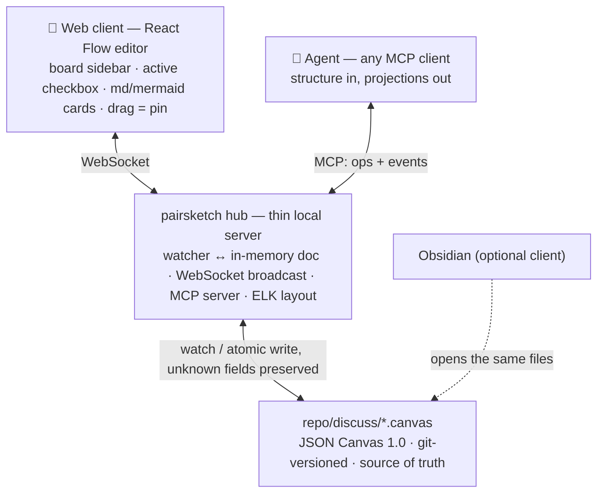

# pairsketch — founding design document

*2026-07-03 · status: RFC. Everything here is open to challenge — open an issue citing the decision number (D1–D5).*

## Motivation

Most human–agent interaction happens in a terminal: a great medium for text, a terrible one for visual thinkers. Architecture discussions, trade-off maps, pipeline designs — these want a whiteboard. Commercial whiteboards (Miro, FigJam) have humans as the only first-class citizens, live in the cloud, and know nothing about your repository.

pairsketch's premise: **every repo can host a visual discussion space** whose clients are humans *and* agents. Humans pick an *active board* and manipulate it spatially; agents observe, propose, and edit the same board through a protocol that suits them. Boards are files in the repo, so the discussion is versioned, greppable, and owned by you.

## Framing: two ontologies, one asymmetry

Diagram formats split into two worldviews:

| | Structure-first (Mermaid) | Position-first (JSON Canvas) |
|---|---|---|
| Source of truth | nodes & relations in text | coordinates & sizes (`x, y, w, h`) |
| Layout | derived by an engine (dagre/ELK), recomputed every render | stored explicitly; what you see is what is saved |
| Natural for | **agents** — one text line per relation, ~5–15 tokens/node | **humans** — dragging, grouping, whitespace all carry meaning |
| Weakness | positions have nowhere to live → not draggable | verbose coordinates → read/write cost, spatial reasoning burden |

The asymmetry that drives the whole design: **agents are good at structure, humans are good at position.** Therefore:

- the *persistence layer* must be position-first (otherwise human drags have nowhere to land), and
- the *agent interface* must be structure-first (otherwise agents burn tokens computing pixels),

with an auto-layout engine translating between the two.

## Decisions

### D1 — Persistence: JSON Canvas files in the repo

Boards are [JSON Canvas 1.0](https://jsoncanvas.org/spec/1.0/) files (`discuss/*.canvas` by default) inside the user's repository.

Why JSON Canvas over the alternatives:

- **Cheapest position-first format in existence.** Four node types, under ten required fields. A text node costs roughly 50–80 tokens; an Excalidraw element costs 200–300 (20+ fields: `seed`, `versionNonce`, `roundness`, …); tldraw records are similar. A 30-node board reads at ~3–4k tokens raw, ~⅓ of that as a structural projection.
- **Already in the models' vocabulary.** Open spec since March 2024; large volumes of `.canvas` files in training corpora.
- **Repo-native and git-versioned.** The discussion history rides the same rails as the code it discusses.
- **Obsidian interop for free.** Obsidian (and its ecosystem, e.g. [Advanced Canvas](https://github.com/Developer-Mike/obsidian-advanced-canvas)) opens the same files. See D3.

Rejected: Excalidraw format (5× token cost, no Obsidian-canvas interop), tldraw format (rich but verbose, ecosystem island, production license key), bespoke format (no ecosystem, no training-data familiarity).

<a id="decision-2"></a>
### D2 — No interactive Mermaid engine; Mermaid is an I/O language

The tempting idea — "agents already speak Mermaid, just make Mermaid draggable" — fails at three levels:

1. **Language.** Mermaid's spatial vocabulary is direction (`TD`/`LR`), subgraph membership, and layout *strategy* hints (ELK `nodePlacementStrategy`). There is no legal syntax for "node A sits at (320, 180)". A dragged position has nowhere to persist — unless you invent a dialect (sidecar files, `%%` comment payloads), and that dialect *is* a canvas format.
2. **Ecosystem evidence.** Every 2026 "Mermaid visual editor" confirms this. The open-source [mermaid-visual-editor](https://github.com/saketkattu/mermaid-visual-editor) (React Flow + Dagre) states outright: *"The canvas state is canonical. Mermaid syntax is always derived — never parsed back in."* Commercial editors (Mermaid Studio) claim position write-back with undocumented, non-standard mechanisms no other renderer can read.
3. **Engineering.** Enumerate the requirements — draggable node layer, position persistence, Mermaid serializer — and you have built *a canvas app that exports Mermaid*. Start from the canvas and skip the perpetually-drifting bidirectional sync.

Mermaid keeps two roles, where it is genuinely the best tool:

- **Embedded rendering**: ` ```mermaid ` fenced blocks inside text nodes render in place (Obsidian does this natively; the web client will too). Right for dense pure-structure diagrams — sequence, state — where dragging individual nodes is pointless.
- **One-way import (`insert_mermaid`)**: agent emits Mermaid → hub parses → ELK layout → canvas nodes. From then on the diagram lives in the position-first world. Precedent: Excalidraw's built-in Mermaid import.

### D3 — Obsidian is a client, not the server

Three hard limits rule out Obsidian-as-backend:

1. **GUI-bound.** Plugin-provided REST/MCP endpoints ([Local REST API](https://github.com/coddingtonbear/obsidian-local-rest-api) etc.) run inside the Obsidian process — close the app, connections refuse. No official headless mode.
2. **No operation-level canvas API.** Plugins touch canvases as whole JSON files; there is no node-level API nor cross-client push.
3. **Single-user by design.** Real multiplayer needs third-party CRDT services ([Relay](https://docs.relay.md/features/canvas-multiplayer/); canvas support in beta).

Inverted, this becomes a feature: because the source of truth is files in the vault-openable repo, **Obsidian is the free first client**. It detects external modifications and reloads; a human can work in Obsidian while the agent edits through the hub (turn-based; see D5).

Compatibility contract: Advanced Canvas stores its extensions as extra properties in the same JSON. The hub therefore **preserves unknown fields on every round-trip** (a tested invariant, since the JSON Canvas spec is silent on extensibility). Licensing note: sharing a file format with a GPL-3.0 plugin is fine; importing its code is not.

### D4 — Agent protocol: semantic operations + auto-layout, never pixels

Whole-file read/write is the wrong interaction shape regardless of format. The MCP surface (draft):

| Tool | Purpose | Cost profile |
|---|---|---|
| `list_boards` / `get_active_board` | discover boards; find the human's focus (incl. viewport) | O(boards) |
| `read_board(mode)` | `structure` = coordinate-free adjacency view, short id aliases (default) · `full` · `region` (one group) | structure ≈ ⅓ of full |
| `apply_ops([...])` | batched semantic edits: `add_node`, `update`, `connect`, `group`, `move(relative)` | O(change) |
| `insert_mermaid(text)` | parse → ELK layout → nodes | structure price, positions free |
| `events_since(cursor)` | human activity since last sync: moves, new cards, comments, `@agent` pins | O(diff) |

Layout policy: agents supply structure and *relative* intent ("below B", "in group Risks"); ELK computes coordinates incrementally. **Any node a human has dragged is `pinned`**; auto-layout routes around pinned nodes. This pinned/auto hybrid is the heart of the UX and gets prototyped early.

On a 30-node board, a typical agent turn ("add three nodes, connect two edges") should cost hundreds of tokens, not thousands. *All token figures in this document are order-of-magnitude estimates to be measured in Phase 0.*

### D5 — Concurrency: turn-based first, CRDT later

Phase 0–1 use file-level last-write-wins with atomic writes (temp file + rename), mtime checks, debounce, and an event feed — the model [Kanvas](https://github.com/XMihura/Kanvas) proved sufficient for human+agent boards. Live simultaneous editing (Yjs document layer, files demoted to persistence snapshots) is Phase 2, *after* turn-based collaboration proves the interaction is worth it. Do not pay the CRDT complexity tax up front.

## Architecture



Every layer degrades independently: server down → humans still edit in Obsidian; no Obsidian → web client suffices; all clients closed → agents still read/write files. That resilience is the dividend of choosing the persistence layer well.

Planned package layout (monorepo, TypeScript):

- `packages/canvas-kit` — JSON Canvas parse/serialize (Obsidian-compatible formatting, unknown-field round-trip), structural projection, ELK layout adapter, Mermaid importer.
- `packages/hub` — the local server: watcher, WebSocket, MCP (stdio + HTTP).
- `packages/web` — React Flow client.

### The active-board loop

1. Human ticks a board **active** in the web sidebar (precedent: [Bragi Canvas](https://community.obsidian.md/plugins/bragi-canvas) exposes the currently-open canvas over local MCP).
2. Hub records + broadcasts; subscribed agents are notified.
3. Agent's `get_active_board` → structural read → `apply_ops`; edits stream to the browser.
4. Humans answer *on the board*: drag (pins), annotate, or drop an `@agent` pin — a structured question anchored to a node, which surfaces in `events_since`.

## Roadmap

| Phase | Scope | Validates |
|---|---|---|
| **0 — zero frontend** | MCP server + `.canvas` + Obsidian as viewer; structural projection + `apply_ops` + ELK | that board-based discussion beats terminal discussion; real token costs |
| **1 — own client** | hub server (watcher/WS/atomic writes) + React Flow editor + active-board loop | the "agent draws, human sees live, human drags, agent perceives" feel; pinned/auto layout |
| **2 — real-time** | Yjs document layer, presence (human + agent cursors), `insert_mermaid` explode, `@agent` pins, portals | concurrent-edit UX; whether multi-agent boards need turn coordination |

## Risks & open questions

- **Write-format fidelity.** Serialization must match Obsidian's key order/indentation, or every agent edit explodes into whole-file git diffs. Unknown-field round-trip is a tested invariant.
- **React Flow gaps to fill**: group containment semantics, `fromSide`/`toSide` edge mapping, undo/redo, CJK-aware card auto-sizing. Work, not risk.
- **Pinned/auto layout boundary** — the core UX bet; prototype it first.
- **Token estimates need measurement** (Phase 0 exit criterion: a measured token bill for a typical discussion turn).
- **Multi-human is deferred.** Primary scenario is one human + several agents. True multi-human arrives with Phase 2 (Yjs), or via Relay on the Obsidian side.

<a id="prior-art"></a>
## Prior art

| Project | What it is | What it proves for us |
|---|---|---|
| [Kanvas](https://github.com/XMihura/Kanvas) | humans + agents co-manage Obsidian Canvas project boards; agents use semantic CLI ops; DAG auto-layout | the whole turn-based `.canvas`-as-truth loop; agents must not hand-edit JSON |
| [Bragi Canvas](https://community.obsidian.md/plugins/bragi-canvas) | currently-open canvas exposed over local MCP | the active-board concept |
| [obsidian-mcp-pro](https://github.com/rps321321/obsidian-mcp-pro), [MCP Connector](https://community.obsidian.md/plugins/mcp-tools-istefox) | canvas read/add-node/add-edge MCP tools | semantic canvas ops are an established MCP pattern; round-trip field preservation matters |
| [excalidash-mcp](https://github.com/davifernan/excalidash-mcp), [mcp_excalidraw](https://github.com/yctimlin/mcp_excalidraw), [Excalidraw+ MCP](https://plus.excalidraw.com/docs/mcp) | agents drawing live on web whiteboards (WebSocket push) | the "agent draws, browser updates live" experience works |
| [tldraw Agent Starter Kit](https://tldraw.dev/starter-kits/agent), [Agents on the Canvas](https://gitnation.com/contents/agents-on-the-canvas-with-tldraw) | cursor-style agents on an infinite canvas; official multi-agent research | the best reference for agent-on-canvas interaction design (viewports, partial observation, streamed ops) |
| [mermaid-visual-editor](https://github.com/saketkattu/mermaid-visual-editor) | React Flow canvas, Mermaid derived one-way | direct evidence for D2 |
| [react-jsoncanvas](https://github.com/Digital-Tvilling/react-jsoncanvas), [JSON-Canvas-Viewer](https://github.com/hesprs/JSON-Canvas-Viewer), [jsoncanvas.org apps](https://jsoncanvas.org/docs/apps/) | JSON Canvas web renderers (viewer-grade) | the format has cross-tool life; a mature open web *editor* is the gap pairsketch fills |
| [Relay canvas multiplayer](https://docs.relay.md/features/canvas-multiplayer/) | CRDT multiplayer for Obsidian, canvas in beta | the Obsidian-side multi-human option, if ever needed |

## References

- [JSON Canvas 1.0 spec](https://jsoncanvas.org/spec/1.0/)
- [Mermaid flowchart syntax](https://mermaid.js.org/syntax/flowchart.html)
- [obsidian-advanced-canvas](https://github.com/Developer-Mike/obsidian-advanced-canvas) (GPL-3.0 — format-compatible, code off-limits)
- [obsidian-local-rest-api](https://github.com/coddingtonbear/obsidian-local-rest-api)
- [tldraw license](https://tldraw.dev/community/license), [tldraw-sync-cloudflare](https://github.com/tldraw/tldraw-sync-cloudflare)
- [ELK (Eclipse Layout Kernel)](https://eclipse.dev/elk/), [React Flow](https://reactflow.dev/), [Yjs](https://yjs.dev/)
